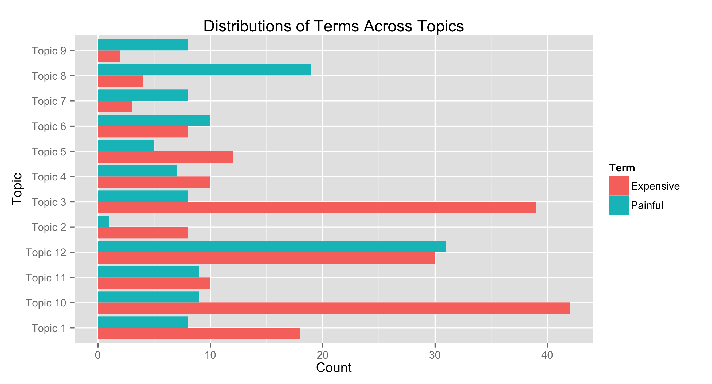

Exploring Negativity in Yelp Reviews of Healthcare Providers
========================================================
author: VP Nagraj       
date: November 20 2015
transition: rotate
font-family: 'Helvetica'

The Data
========================================================

- Yelp Academic Dataset
    - JavaScript Object Notation (JSON) format
- Negative Reviews
    - Less than 3 stars
- Healthcare Providers  
    - Categorized as "Health"

Question(s) & Answer(s)
========================================================

Q: Can these reviews be modeled or classified into "types" based on their content?

A: Yes.

Q: Are there any trends within the descriptive language of each "type" of negative review?

A: Yes.

Topics & Top 3 Terms
========================================================

- Topic 1 = shot, horrible, script
- Topic 2 = son, parent, contract
- Topic 3 = store, food, product
- Topic 4 = dont, ear, fax
- Topic 5 = unprofessional, waiting, attitude
- Topic 6 = mother, mri, knee
    
***

- Topic 7 = appt, fee, collect
- Topic 8 = massag, foot, groupon
- Topic 9 = daughter, wife, ultrasound
- Topic 10 = glass, lens, sale
- Topic 11 = hair, inject, laser
- Topic 12 = dentist, tooth, crown

The Analysis In Practice
========================================================
The modeled data can be split by topic and analyzed for descriptive language ...

The Analysis In Summary
========================================================

1. Reads in and merges JSON data
3. Filters in "bad" reviews
4. Filters in healthcare providers
5. Preps the data as a document term matrix
6. Models the data with mutliple Latent Dirichlet Allocation (LDA) methods
7. Provides diagnostics for model accuracy
8. Models the data with the "best" method
9. Splits the data by topic
10. Tags adjectives to review text
11. Summarizes prevalence of adjectives in each topic
